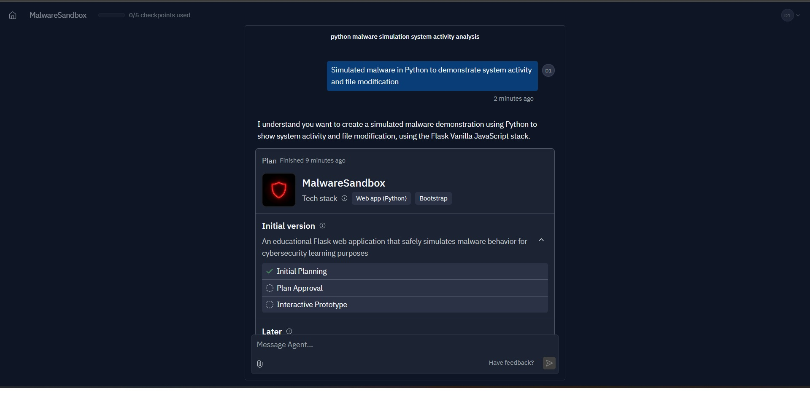
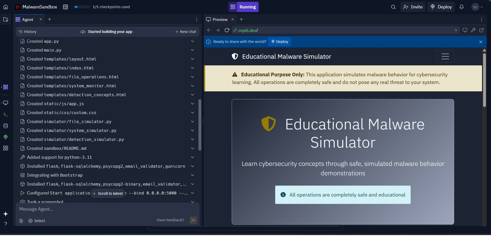
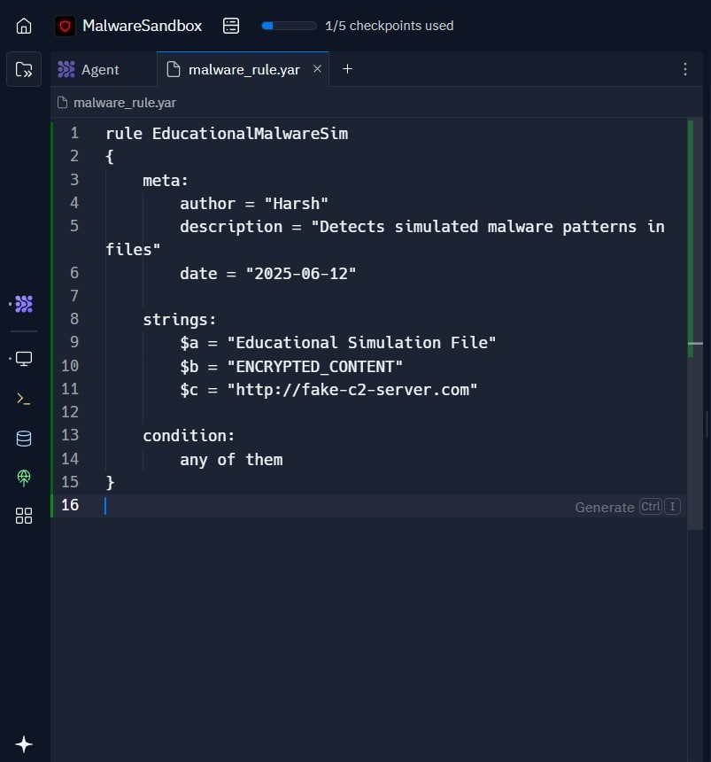
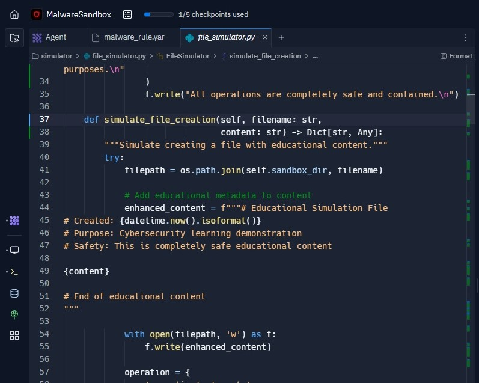
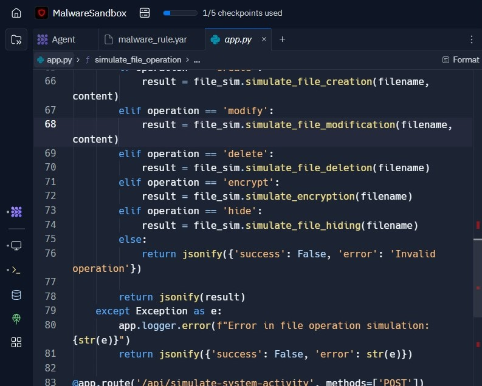
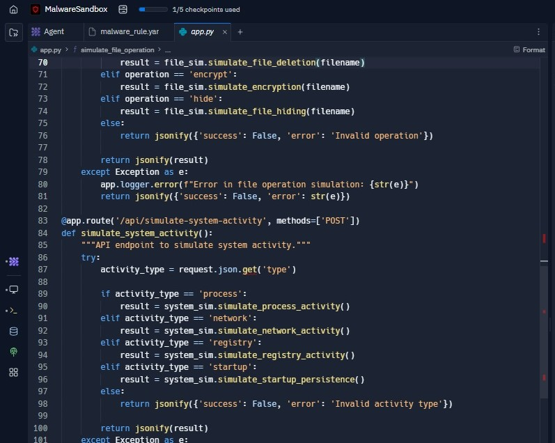
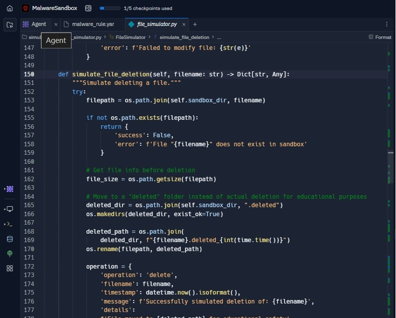
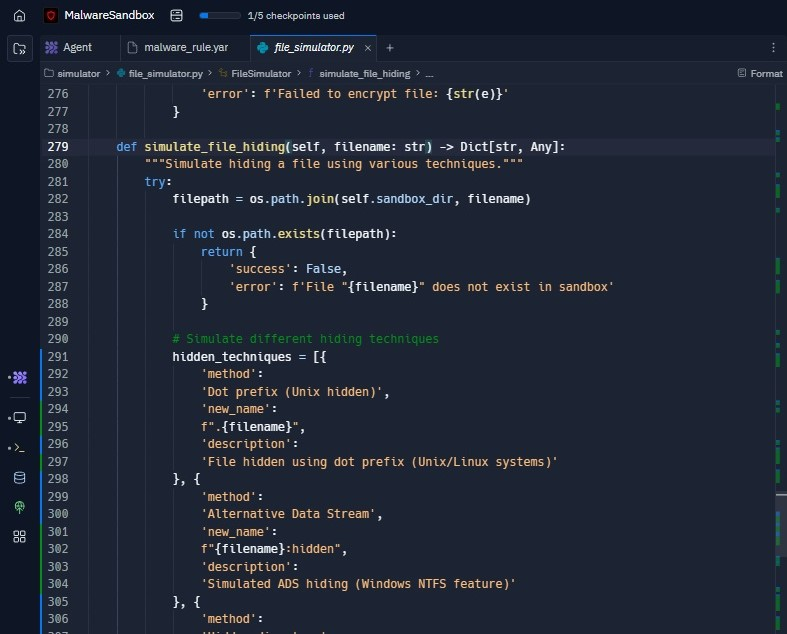

# YARA Threat Detection Lab

## 📌 Overview

This project demonstrates simulated threat behavior and YARA based detection techniques within a controlled educational sandbox environment using Replit. The objective of the project was to safely simulate malware like behaviors such as file creation, modification, encryption, deletion, process execution, registry access and network communication while applying custom YARA rules for detection and analysis.

The project was developed using Python and Flask within an isolated Replit environment to ensure safe execution and controlled behavioral monitoring. The simulation focuses on defensive cybersecurity concepts including detection engineering, behavioral analysis and threat monitoring workflows commonly used in Security Operations Centers (SOC).

This project was created strictly for educational and defensive cybersecurity research purposes.

---

# 🎯 Objective

The primary objective of this project was to:

- Simulate malware like behaviors in a safe and isolated sandbox environment
- Develop and apply custom YARA rules for threat detection
- Understand behavioral indicators associated with suspicious activities
- Demonstrate basic detection engineering concepts
- Generate security relevant telemetry for analysis
- Explore safe malware simulation techniques for cybersecurity education

---

# 🛠️ Tools & Technologies Used

- Python
- Flask Web Framework
- Replit Sandbox Environment
- YARA
- HTML/CSS/JavaScript
- File System Simulation Techniques
- Behavioral Logging Mechanisms

---

# 🌐 Lab Environment

| Component | Purpose |
|---|---|
| Replit | Secure cloud-based sandbox environment |
| Python | Threat behavior simulation |
| Flask | Web application framework |
| YARA | Threat detection and rule matching |
| HTML/CSS/JS | User interface development |

### Environment Characteristics
- Isolated educational sandbox
- Controlled simulation environment
- No interaction with external systems
- Safe behavioral emulation only

---

# 🔄 Project Workflow

The following workflow was implemented during the project:

1. Planned a safe malware simulation architecture
2. Created project environment in Replit
3. Developed Flask-based simulation interface
4. Generated malware simulation functions
5. Implemented file activity simulations
6. Simulated system-level activities
7. Created custom YARA detection rules
8. Tested detection logic against simulated behaviors
9. Documented results and observations

---

# 🧱 Project Architecture

## `file_simulator.py`

Responsible for simulating:
- File creation
- File modification
- File encryption
- File hiding
- File deletion

## `app.py`

Handles:
- Flask application routes
- Simulation triggers
- Logging operations
- User interaction

## Frontend Templates

Includes:
- HTML
- CSS
- JavaScript

These files provide the graphical interface for interacting with the simulation environment.

---

# 🛡️ YARA Rule Development

A custom YARA rule named:

```yara
EducationalMalwareSim
```

It was created to detect simulated suspicious behavior generated by the application.

## Rule Metadata

| Field | Value |
|---|---|
| Rule Name | EducationalMalwareSim |
| Author | Harsh |

## Detection Strings

The rule searches for:
- `"Educational Simulation File"`
- `"ENCRYPTED_CONTENT"`
- `"http://fake-c2-server.com"`

These strings simulate indicators commonly analyzed during malware investigations and threat hunting operations.

---

# ⚙️ Simulated Behaviors

## 📁 File Creation Simulation

The function:

```python
simulate_file_creation()
```

This creates simulated files within the sandbox environment and logs all activity for visibility and analysis.

---

## ✏️ File Modification Simulation

The application modifies simulated files to imitate suspicious behavioral changes commonly associated with malware activity.

---

## 🔒 File Encryption Simulation

The project simulates file encryption behavior by replacing file content with predefined encrypted markers.

This behavior is designed strictly for educational detection testing.

---

## 🫥 File Hiding Simulation

The application simulates hidden file behavior within the sandbox environment to demonstrate stealth related concepts.

---

## 🌐 Simulated System Activities

The Flask application simulates:
- Process creation
- Network communication
- Registry access
- Startup persistence activity

These simulations help generate behavioral indicators for detection engineering exercises.

---

## 🗑️ File Deletion Simulation

The function:

```python
simulate_file_deletion()
```

This moves files into a `.deleted` directory instead of permanently deleting them.

This ensures:
- safety
- traceability
- and forensic visibility.

---

# 📸 Screenshots

## 📁 Step 1: Planning and Setup

Created the initial MalwareSandbox project in Replit and planned a secure educational malware simulation workflow using AI assisted development.



---

## 🧱 Step 2: Code Generation and File Structure

Configured the Flask based application environment including backend modules, templates, simulation components and live preview integration.



---

## 🛡️ Step 3: Writing YARA Rule

Developed a custom YARA rule named `EducationalMalwareSim` to detect simulated malware indicators and suspicious behavioral patterns.



---

## 📁 Step 4: Simulating File Creation

Implemented sandbox safe file creation simulation logic for generating controlled malware like artifacts and behavioral indicators.



---

## 🔒 Step 5: Simulating File Modification, Encryption and Hiding

Implemented API endpoints and backend logic to simulate file modification, encryption and malware style behavior safely within the sandbox.



---

## 🌐 Step 6: Simulating System Activities

Implemented simulated process execution, registry behavior, startup persistence and network activity for detection engineering demonstrations.



---

## 🗑️ Step 7: Simulating File Deletion

Created a secure deletion simulation mechanism by moving files into an isolated `.deleted` directory for forensic visibility and recovery.



---

## 👁️ Step 8: Simulating File Hiding Techniques

Implemented educational demonstrations of common file hiding techniques including dot prefix hiding and Alternate Data Streams (ADS).



---

# 📊 Key Findings

- YARA rules successfully detected predefined suspicious indicators
- Simulated behavioral patterns generated valuable detection telemetry
- Flask provided an effective framework for simulation control
- Replit offered a secure sandbox environment for educational testing
- Simulated system activities improved understanding of threat behaviors
- Detection engineering concepts can be practiced safely using sandbox simulations

---

# 🧠 Skills Demonstrated

- YARA Rule Development
- Detection Engineering
- Threat Behavior Simulation
- Python Development
- Flask Web Application Development
- Security Monitoring Concepts
- Behavioral Analysis
- Sandbox Environment Usage
- Log Analysis
- Threat Detection Workflows

---

# 🛡️ Cybersecurity Relevance

This project demonstrates foundational concepts relevant to:

- Security Operations Centers (SOC)
- Threat Hunting
- Malware Analysis
- Detection Engineering
- Behavioral Monitoring
- Incident Response
- Security Research

The simulated workflows reflect practical detection concepts used in modern cybersecurity environments.

---

# ⚖️ Ethical Use Notice

This project was conducted in a controlled and isolated educational sandbox environment for defensive cybersecurity research and learning purposes only.

No unauthorized systems, networks or third-party environments were targeted or accessed during the development or testing of this project.

---

# 📄 Detailed Report

[View Full Report](yara-threat-detection-report.pdf)

---

# 🔚 Conclusion

This project successfully demonstrates simulated malware like behavior and YARA based threat detection techniques within a safe educational sandbox environment. The implementation provided practical exposure to behavioral analysis, detection engineering concepts and security monitoring workflows commonly used in cybersecurity operations.

The project highlights the importance of proactive detection mechanisms and reinforces foundational defensive cybersecurity principles through safe and controlled simulations.

---

# 👨‍💻 Author

Harsh – Cybersecurity Enthusiast
